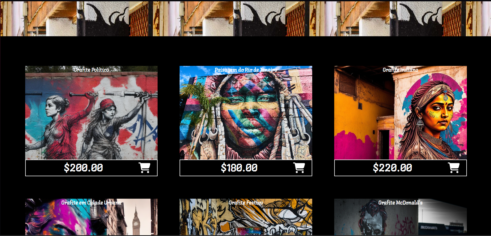
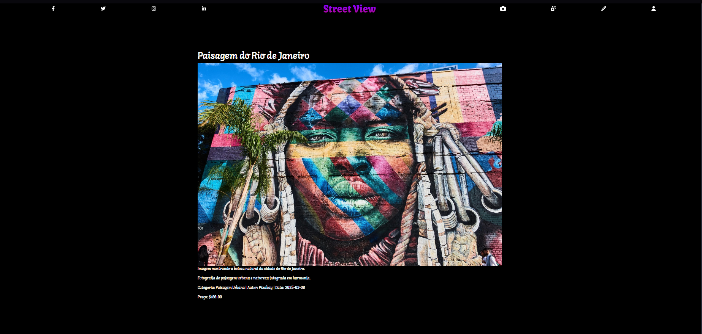

# Trabalho Prático 05 - Semanas 7 e 8

**Páginas de detalhes dinâmicas**

Nessa etapa, vamos evoluir o trabalho anterior, acrescentando a página de detalhes, conforme o  projeto escolhido. Imagine que a página principal (home-page) mostre um visão dos vários itens que existem no seu site. Ao clicar em um item, você é direcionado pra a página de detalhes. A página de detalhe vai mostrar todas as informações sobre o item do seu projeto. seja esse item uma notícia, filme, receita, lugar turístico ou evento.

Leia o enunciado completo no Canvas. 

**IMPORTANTE:** Assim como informado anteriormente, capriche na etapa pois você vai precisar dessa parte para as próximas semanas. 

**IMPORTANTE:** Você deve trabalhar e alterar apenas arquivos dentro da pasta **`public`,** mantendo os arquivos **`index.html`**, **`styles.css`** e **`app.js`** com estes nomes, conforme enunciado. Deixe todos os demais arquivos e pastas desse repositório inalterados. **PRESTE MUITA ATENÇÃO NISSO.**

## Informações Gerais

- Nome: Sofia Ferreira Costa
- Matricula: 902830
- Proposta de projeto escolhida: Galeria e obras.
- Breve descrição sobre seu projeto:  O projeto se trata de uma galeria online que expõe e vende pinturas e fotografias ligadas à arte de rua.

## Print da Home-Page

Para melhor coerência com a minha ideia do projeto adicionei uma página extra "photographs.html" para carregar as imagens.





## Cole aqui abaixo a estrutura JSON utilizada no app.js

```javascript
const gallery = [ 
    {
      id: 2,
      titulo: "Grafite Político",
      descricao: "Desenho de grafite com temática política.",
      conteudo: "Ilustração detalhada de graffiti político, mostrando arte urbana engajada.",
      categoria: "Arte de Rua",
      autor: "Leonardo AI",
      data: "2025-03-30",
      imagem: "https://cdn.leonardo.ai/users/62103611-9796-4122-8589-b5731d68e6bd/generations/eabb72be-a801-4378-a78e-5202b6ac5d51/Ilustration_V2_political_graffiti_drawing_0.jpg",
      price: 200.00
    },
    {
      id: 3,
      titulo: "Paisagem do Rio de Janeiro",
      descricao: "Imagem mostrando a beleza natural da cidade do Rio de Janeiro.",
      conteudo: "Fotografia de paisagem urbana e natureza integrada em harmonia.",
      categoria: "Paisagem Urbana",
      autor: "Pixabay",
      data: "2025-03-30",
      imagem: "https://cdn.pixabay.com/photo/2018/07/20/01/42/rio-de-janeiro-3549798_1280.jpg",
      price: 180.00
    },
    {
      id: 4,
      titulo: "Grafite Indiano",
      descricao: "Arte urbana inspirada na cultura indiana.",
      conteudo: "Ilustração detalhada de graffiti com elementos culturais da Índia.",
      categoria: "Arte de Rua",
      autor: "Leonardo AI",
      data: "2025-03-30",
      imagem: "https://cdn.leonardo.ai/users/62103611-9796-4122-8589-b5731d68e6bd/generations/f5906da8-87e4-451f-a69d-128fc2704212/Ilustration_V2_indian_graffiti_0.jpg",
      price: 220.00
    },
    {
      id: 5,
      titulo: "Grafite em Cidade Urbana",
      descricao: "Arte urbana detalhando grafites nas paredes da cidade.",
      conteudo: "Ilustração mostrando a combinação de cores e formas de graffiti urbano.",
      categoria: "Arte de Rua",
      autor: "Leonardo AI",
      data: "2025-03-30",
      imagem: "https://cdn.leonardo.ai/users/62103611-9796-4122-8589-b5731d68e6bd/generations/eb233b7e-c529-4ea9-aa6d-27ae9d16eca7/Ilustration_V2_city_graffiti_0.jpg",
      price: 210.00
    },
    {
      id: 6,
      titulo: "Grafite Festivo",
      descricao: "Grafite colorido com temática festiva e alegre.",
      conteudo: "Fotografia mostrando cores vibrantes em mural urbano.",
      categoria: "Arte de Rua",
      autor: "Pixabay",
      data: "2025-03-30",
      imagem: "https://cdn.pixabay.com/photo/2019/12/25/19/57/grafitti-4719165_1280.jpg",
      price: 190.00
    },
    {
      id: 7,
      titulo: "Grafite McDonald's",
      descricao: "Arte urbana retratando marca famosa em estilo grafite.",
      conteudo: "Fotografia urbana mostrando publicidade e arte de rua combinadas.",
      categoria: "Arte de Rua",
      autor: "Pixabay",
      data: "2025-03-30",
      imagem: "https://cdn.pixabay.com/photo/2017/04/13/14/15/mcdonalds-2227657_1280.jpg",
      price: 170.00
    },
    {
      id: 8,
      titulo: "Grafite Político Pintado",
      descricao: "Obra de grafite política com cores vibrantes e formas impactantes.",
      conteudo: "Ilustração de graffiti político mostrando a força da mensagem urbana.",
      categoria: "Arte de Rua",
      autor: "Leonardo AI",
      data: "2025-03-30",
      imagem: "https://cdn.leonardo.ai/users/62103611-9796-4122-8589-b5731d68e6bd/generations/cb3254d5-5e90-4b27-95b4-344936b6913e/Ilustration_V2_political_graffiti_painting_0.jpg",
      price: 230.00
    },
    {
      id: 9,
      titulo: "História do Grafite",
      descricao: "Fotografia histórica de grafite representando diversas eras da arte urbana.",
      conteudo: "Imagem de grafite mostrando evolução da arte de rua.",
      categoria: "Arte de Rua",
      autor: "Leonardo AI",
      data: "2025-03-30",
      imagem: "https://cdn.leonardo.ai/users/62103611-9796-4122-8589-b5731d68e6bd/generations/3bab1f5b-ad39-452e-ab04-bc6dafc2c9b9/Absolute_Reality_v16_photograph_history_graffiti_0.jpg",
      price: 240.00
    },
    {
      id: 10,
      titulo: "Grafite Contemporâneo",
      descricao: "Arte urbana contemporânea em mural público.",
      conteudo: "Fotografia mostrando detalhes e cores de grafite moderno.",
      categoria: "Arte de Rua",
      autor: "Pixabay",
      data: "2025-03-30",
      imagem: "https://cdn.pixabay.com/photo/2018/05/22/00/43/graffiti-3420171_1280.jpg",
      price: 200.00
    }
];
```
